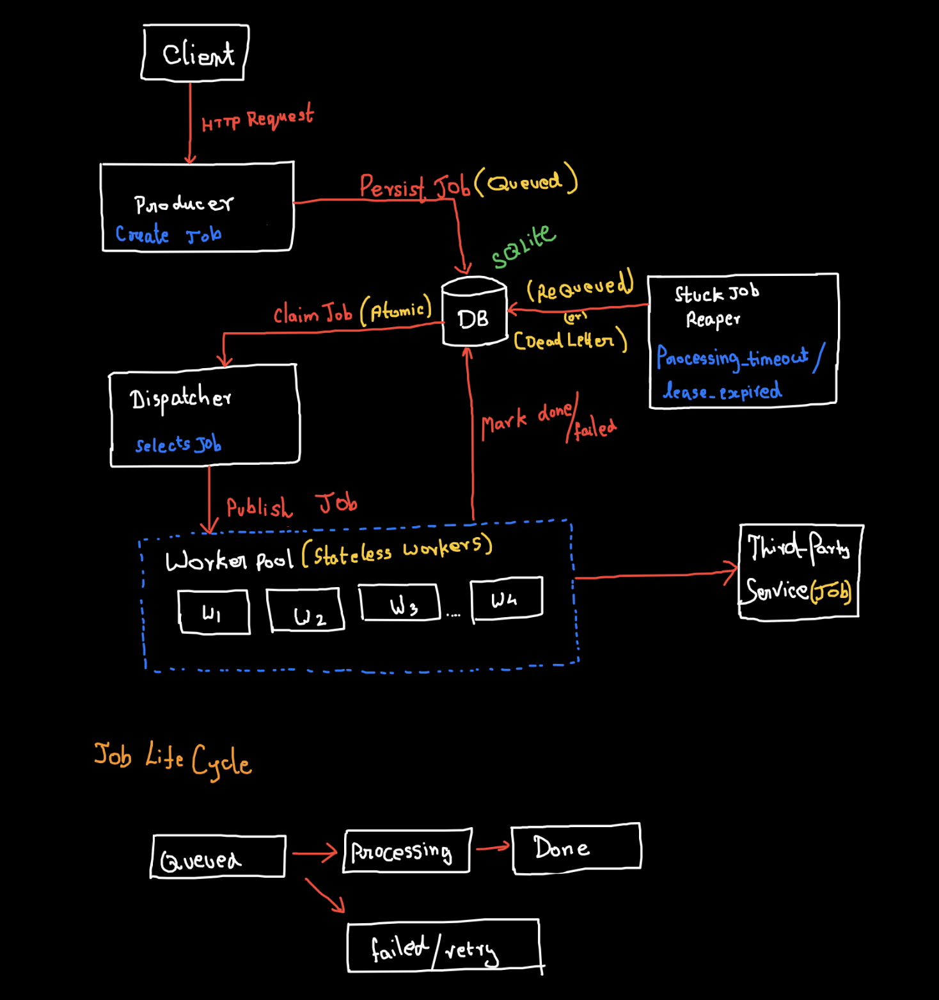

# Event-Driven Job Queue

> **A crash-resilient, persistent background job system**  
> _A minimal Sidekiq / Celery–style queue focused on correctness under failure_

---

## Overview
> Event-Driven Job Queue is a persistent, event-driven background job system designed to survive process crashes, worker failures, and unclean shutdowns without losing work.
>
> The system is intentionally simple:
> - Jobs are durably persisted
> - Execution is at-least-once
> - Recovery is explicit and deterministic
>
> _This **system guarantees at-least-once execution** and **explicitly does NOT attempt exactly-once semantics.**_
---

## Problem Statement
> Background job processing looks easy until failure happens.
>
> - Processes crash mid-execution 
> - Workers die without cleanup
> - Shutdowns interrupt in-flight jobs
> - Retries cause duplicate side effects
> - Silent job loss is unacceptable 

Preventing all duplicate execution is impractical in real systems.
The real problem is **never losing work while recovering safely from failure.**
This project focuses on that exact problem.

## Core Design Principle
> Never lose a persisted job.
>
> Duplicate execution is acceptable. Silent loss is not.
>
The system is built around this invariant
---

## Guarantees

This system guarantees:

- **At-least-once execution**  
- **No job loss after persistence**  
- **Crash recovery on restart**
- **Eventual recovery of stuck jobs via visibility timeouts**  
- **Bounded retries and bounded concurrency**  
- **Graceful shutdown without partial job state writes**

Duplicate execution is possible by design and must be handled via idempotent side effects where required.

This system does **NOT** guarantee:

- **Exactly-once execution**  
- **Distributed fault tolerance**  
- **Global job ordering**  
- **Real-time execution guarantees**

**These trade-offs are intentional and enable simpler recovery and failure handling.**

---

## Failure Model

The system is designed under the assumption that failures are normal, not exceptional.

| Failure Scenario | System Behavior |
|------------------|-----------------|
| Process crash | Jobs are durably recovered from persistence on restart |
| Worker crash mid-execution | Job becomes eligible for re-dispatch after visibility timeout |
| Duplicate execution | Allowed and expected; external side effects must be idempotent |
| Shutdown during execution | Graceful shutdown prevents partial state commits |

Failure handling is explicit and deterministic, prioritizing correctness and recoverability over best-effort execution.

---

## Non-Goals

The system explicitly does **NOT** attempt to solve:

- **Exactly-once semantics**  
- **Distributed scheduling across nodes**  
- **High-throughput streaming**  
- **Horizontal database scalability**

**The design prioritizes correctness, clarity, and failure-mode reasoning over scale.**

---

## ⚙️ Architecture
**Execution flow:**
<p align="center">
  
</p>

**Core principles:**

- **The database is the single source of truth**
- **In-memory components coordinate execution, not correctness**
- **Correctness is enforced via atomic state transitions, not worker behavior**
- **Scheduling decisions are centralized to simplify correctness reasoning**


## Design Details

**Full design rationale, failure modes, and explicit trade-offs are documented here:**

👉 **[DESIGN.pdf](docs/DESIGN.pdf)**

## Build & Run

### Prerequisites

- **Go 1.20+**
- **No external dependencies**
  - SQLite is embedded via `modernc.org/sqlite`

### Configuration

Certain job handlers (e.g., email delivery) require external credentials.

The system reads configuration from environment variables, typically
loaded via a `.env` file during local development.

### Worker Count
 ``` bash 
 WORKER_COUNT=10
 ```

### Email Configuration (Example)

```env
SMTP_HOST=smtp.gmail.com
SMTP_PORT=587 
GMAIL_USER=your@gmail.com
GMAIL_APP_PASSWORD=your-app-password
```
These credentials are required only for job types that perform
external side effects (such as sending emails).

**The job queue remains fully functional without this configuration; only the corresponding job handlers will fail.**


---

### Compile

Build the server binary:

```bash
go build -o bin/server ./cmd/server 
```
This produces a standalone executable at: 
```bash
bin/server
```

### Run 

Start the job queue server:
```bash
./bin/server
```
The server listens on port 8080 by default.

### Submit a Job

Jobs are submitted via HTTP :
```bash
curl -X POST http://localhost:8080/createJob \
  -H "Content-Type: application/json" \
  -d '{
    "type": "email",
    "payload": {
      "email": "user@example.com",
      "subject": "Welcome",
      "message": "Hello"
    },
    "max_retries": 3,
    "idempotency_key": "welcome-New-user-123"
  }'
```

### Response Semantics

- `201 Created`
Job was durably persisted and scheduled for execution.

- `429 Too Many Requests`
System is under backpressure. Client should retry later.


