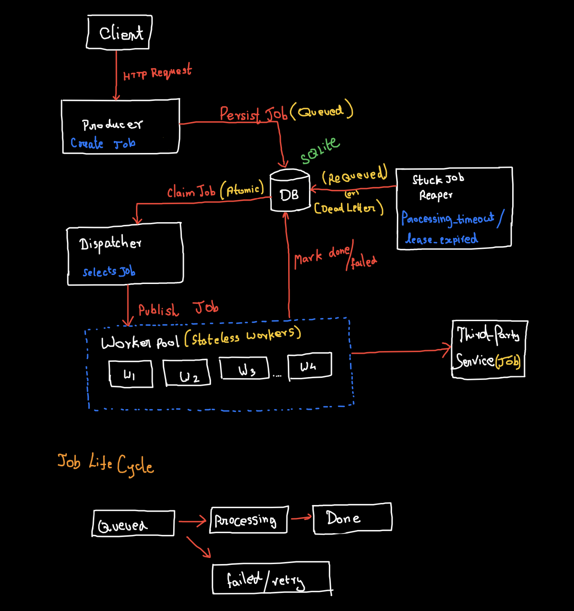

# Event-Driven Job Queue

> **A crash-resilient, persistent background job system**  
> _A minimal Sidekiq / Celery–style queue focused on correctness under failure_
>
>_**Tech Stack**: Go, SQLite (WAL), HTTP, Worker Pools_
---

## Overview
> Event-Driven Job Queue is a persistent, event-driven background job system designed to survive process crashes, worker failures, and unclean shutdowns without losing work.
>
> The system is intentionally simple:
> - Jobs are durably persisted
> - Execution is at-least-once
> - Recovery is explicit and deterministic
>
---

## Problem Statement
> Background job processing looks easy until failure happens.
>
> - Processes crash mid-execution 
> - Workers die without cleanup
> - Shutdowns interrupt in-flight jobs
> - Retries cause duplicate side effects
> - Silent job loss is unacceptable 
>
>Preventing all duplicate execution is impractical in real systems.The real problem is **never losing work while recovering safely from failure.** This project focuses on that exact problem.
---
## Core Design Principle
> The system is built on a single invariant: **persisted jobs must never be lost.** 
>
> Execution follows an **at-least-once model**, where duplicate runs are acceptable but silent job loss is not.  
>
> SQLite acts as the source of truth, while in-memory components only coordinate execution. 
>
> Correctness is enforced through atomic state transitions and centralized scheduling, not worker behavior.
>
> The system is built around this invariant.

---

## ⚙️ Architecture
**Execution flow:**
<p align="center">
  
</p>

---

## Guarantees

This system guarantees:

- **At-least-once execution**  
- **No job loss after persistence**  
- **Crash recovery on restart**
- **Eventual recovery of stuck jobs via visibility timeouts**  
- **Bounded retries and bounded concurrency**  
- **Graceful shutdown without partial job state writes**

Duplicate execution is possible by design and must be handled via idempotent side effects where required.

This system does **NOT** guarantee:

- **Exactly-once execution**  
- **Distributed fault tolerance**  
- **Global job ordering**  
- **Real-time execution guarantees**

**These trade-offs are intentional and enable simpler recovery and failure handling.**

---
## Performance Characteristics

## Performance Characteristics

### Scaling Behavior

System performance was evaluated using **50,000 jobs (~100ms execution time)** across varying concurrency levels:

| Workers | Avg Queue Time |
|--------|---------------|
| 10     | ~200 sec      |
| 20     | ~69 sec       |
| 50     | ~0.5 sec      |
| 100    | ~0.25 sec     |
| 200    | ~0.25 sec     |
| 500    | ~0.25 sec     |

---

### Key Observations

#### 1. Scaling improves performance — up to a point

- Increasing workers from **10 → 50** significantly reduces queue latency  
- Increasing further (**50 → 100**) provides marginal gains  
- Beyond **100 workers**, no meaningful improvement is observed  

👉 Demonstrates **diminishing returns with increased concurrency**

---

#### 2. Optimal concurrency range

The system achieves near-optimal performance at:

> **~50–100 workers**

- Queue latency stabilizes (~250ms)  
- Additional workers do not improve throughput  

---

#### 3. Over-provisioning at high concurrency

At higher worker counts (**200–500**):

- Workers are frequently idle  
- Jobs complete faster than they can be scheduled  
- Queue drains rapidly  

👉 Indicates **under-utilization due to excessive concurrency**

---

#### 4. Throughput characteristics

Throughput is primarily bounded by:

- **Worker concurrency**  
- **SQLite write serialization**  
- **WAL + fsync commit latency**  

At higher concurrency levels:

- Throughput plateaus  
- Latency stabilizes  
- No increase in failures or retries observed  

👉 Indicates the system is no longer bottlenecked by execution or queuing

---

#### 5. Workload-bound system behavior

Under lightweight workloads (~100ms jobs):

- The system becomes **workload-bound**, not resource-bound  
- Increasing concurrency does not improve performance  

---

### Real-World Workload Considerations

When executing real-world jobs (e.g., email delivery, webhooks, external APIs):

System throughput becomes dominated by:

- **Network latency**  
- **External service rate limits**  
- **Provider SLAs**  

👉 The queue engine remains stable, but the bottleneck shifts to **external dependencies**

---
## Observability

The system exposes runtime health metrics for operational visibility:

- active workers  
- queue depth  
- retry count  
- success / failure counts  
- dead-letter count  
- average queue latency  
- average execution latency  

Metrics are maintained in memory and reflect real-time system behavior.

Throughput is measured via controlled load testing and derived from completed jobs over time, rather than exposed as a live runtime metric.

---

## Failure Model

The system is designed under the assumption that failures are normal, not exceptional.

| Failure Scenario | System Behavior |
|------------------|-----------------|
| Process crash | Jobs are durably recovered from persistence on restart |
| Worker crash mid-execution | Job becomes eligible for re-dispatch after visibility timeout |
| Duplicate execution | Allowed and expected; external side effects must be idempotent |
| Shutdown during execution | Graceful shutdown prevents partial state commits |

Failure handling is explicit and deterministic, prioritizing correctness and recoverability over best-effort execution.

---

## Non-Goals

The system explicitly does **NOT** attempt to solve:

- **Exactly-once semantics**  
- **Distributed scheduling across nodes**  
- **High-throughput streaming**  
- **Horizontal database scalability**

**The design prioritizes correctness, clarity, and failure-mode reasoning over scale.**

---

## Design Details

**Full design rationale, failure modes, and explicit trade-offs are documented here:**

👉 **[DESIGN.pdf](docs/DESIGN.pdf)**

## Build & Run

### Prerequisites

- **Go 1.20+**
- **No external dependencies**
  - SQLite is embedded via `modernc.org/sqlite`

### Configuration

Certain job handlers (e.g., email delivery) require external credentials.

The system reads configuration from environment variables, typically
loaded via a `.env` file during local development.

### Worker Count
 ``` bash 
 WORKER_COUNT=10
 ```

### Email Configuration (Example)

```env
SMTP_HOST=smtp.gmail.com
SMTP_PORT=587 
GMAIL_USER=your@gmail.com
GMAIL_APP_PASSWORD=your-app-password
```
These credentials are required only for job types that perform
external side effects (such as sending emails).

**The job queue remains fully functional without this configuration; only the corresponding job handlers will fail.**


---

### Compile

Build the server binary:

```bash
go build -o bin/server ./cmd/server 
```
This produces a standalone executable at: 
```bash
bin/server
```

### Run 

Start the job queue server:
```bash
./bin/server
```
The server listens on port 8080 by default.

### Submit a Job

Jobs are submitted via HTTP :
```bash
curl -X POST http://localhost:8080/createJob \
  -H "Content-Type: application/json" \
  -d '{
    "type": "email",
    "payload": {
      "email": "user@example.com",
      "subject": "Welcome",
      "message": "Hello"
    },
    "max_retries": 3,
    "idempotency_key": "welcome-New-user-123"
  }'
```

### Response Semantics

- `201 Created`
Job was durably persisted and scheduled for execution.

- `429 Too Many Requests`
System is under backpressure. Client should retry later.

--- 

## Metrics Endpoint

Runtime metrics are exposed via an HTTP endpoint:

```bash
GET http://localhost:8080/metrics
```

### Example response:
```json
{
  "active_workers": 0,
  "avg_execution_ms": 50,
  "avg_time_in_queue_ms": 195,
  "dead_letter_count": 0,
  "failure_count": 0,
  "queue_depth": 0,
  "retry_count": 0,
  "success_count": 10968
}
```

### Metric definitions

- **active_workers** — number of jobs currently executing  
- **queue_depth** — jobs waiting in persistence  
- **avg_execution_ms** — average job execution latency  
- **avg_time_in_queue_ms** — average time spent waiting before execution  
- **retry_count** — total retry attempts triggered  
- **success_count / failure_count** — completed job outcomes  
- **dead_letter_count** — jobs moved to DLQ after exhausting retries  


